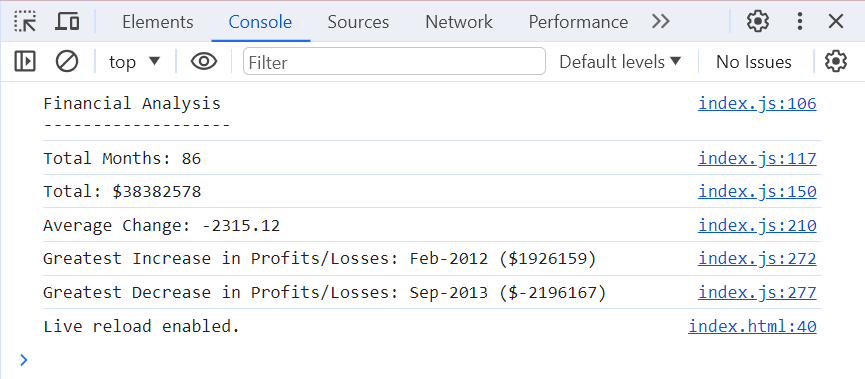

# Console Finances

## Description
This project was created to analyze the financial records of a company. JavaScript was used for analysis and to provide calculations based on these financial records. Calculations can be found in the console and information is available for the total months in the dataset, the total Profit/Loss, the average change in Profit/Losses, the greatest increase and great decrease in Profit/Losses. 

## Installation
N/A

## Usage
You can use this console finances project to view various calculations for the financial records. Calculations are available for the total number of months included in the dataset, the net total amount of Profit/Losses over the entire period, the average of the changes in Profit/Losses over the entire period, the greatest increase in Profit/Losses (date and amount) over the entire period and the greatest decrease in Profit/Losses (date and amount) over the entire period.

Open the ChromeDevTools console to find these calculations.To access the ChromeDevTools console on Mac0S press command+option+I. To access the ChromeDevTools console on Windows press control+shift+I or alternatively you can right click and select "inspect". Then click on the Console Tab (you will find this between Elements and Sources tabs).

The console should open up beside or below the webpage in your browser. You will be able to see a list of all the calculations. If you've opened the console correctly it will look like the image below. 

## Credits
N/A

## License
MIT
